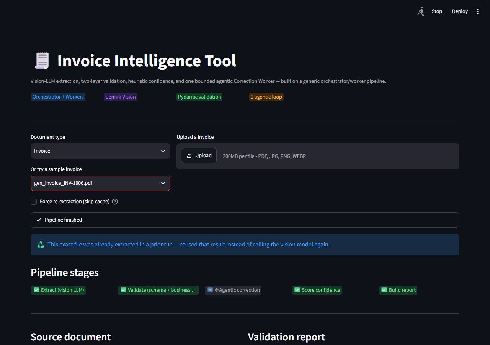
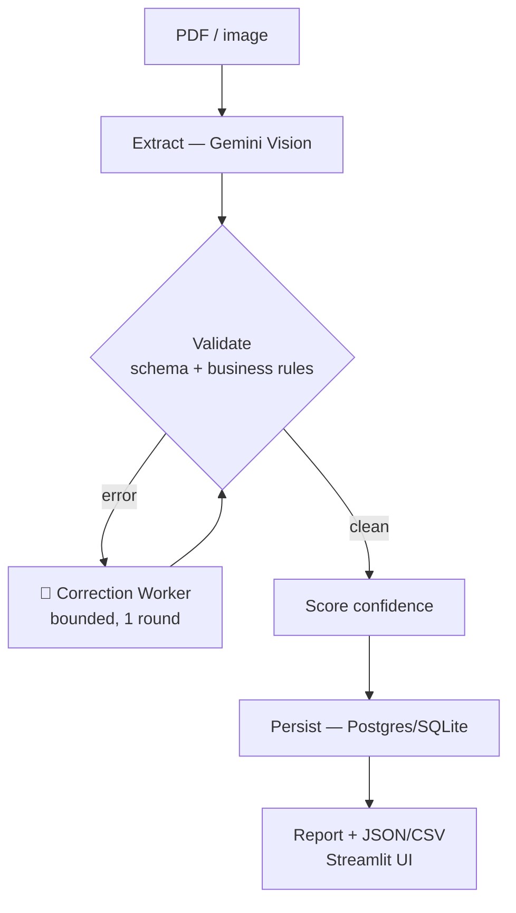
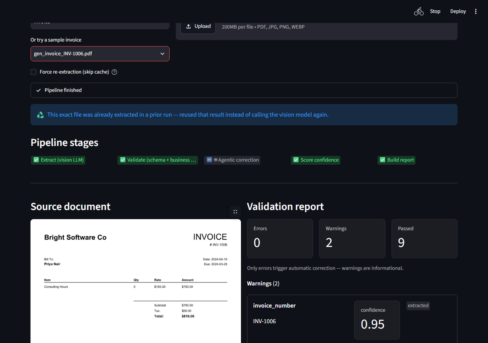
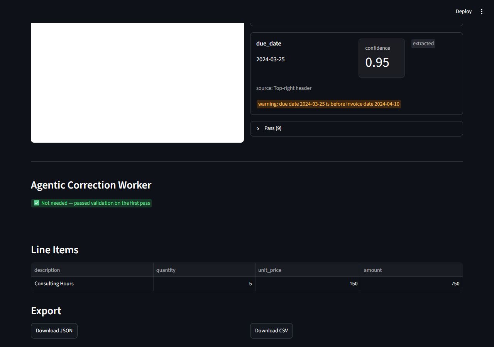

# Invoice Intelligence Tool

  

Upload a scanned invoice or receipt. Get back structured, validated data — not just whatever an
LLM guessed. It flags what's actually wrong (missing fields, bad math, low confidence) instead of
asking you to trust it blindly.



## Why

Accounts-payable teams retype invoices by hand — vendor, dates, line items, totals. The retyping
adds no value; catching mistakes does. This turns that into "confirm these 3 flagged fields," not
"retype the whole document."

## How it works



- **One generic engine, two document types.** Invoices and receipts run on the same
  orchestrator/worker pipeline — adding the second type required zero changes to the core engine.
- **Two validation layers, not one.** "Is this well-formed" (schema) and "is this correct" (does
  the math add up) are different failure classes, checked separately.
- **Only the Correction Worker is agentic.** Extraction is deterministic. Validation is pure
  rule-checking — an LLM never decides whether `subtotal + tax == total`. The one place a model
  makes a real judgment call is bounded: one retry round, capped tool-calling turns.
- **Confidence is computed, never self-reported.** Derived from real signals (did it need a retry,
  did it pass validation), not an LLM's own opinion of itself.

Full decision log (why each choice, what was tried and rejected): [`spec/design.md`](spec/design.md).
Plain-language version with real bugs and how they got fixed: [`GOD_FILE.md`](GOD_FILE.md).

## Results

```
29 hand-verified documents (24 invoices, 5 receipts) — real phone-photo receipts and
web-sourced templates, not just clean synthetic PDFs.

Extraction success: 100.0%  (29/29)
Field accuracy:      99.1%
```

Every miss traced to a specific cause, not noise (see `GOD_FILE.md`). An independent OCR
cross-check was built, measured at a 0% real-error catch rate, and removed — a tested "no" kept
in the docs rather than shipped as dead weight.



## Run it

**Docker (Postgres, no local Poppler needed):**

```bash
cp .env.example .env   # add GEMINI_API_KEY
docker compose up --build
```

**Local (Python + SQLite):**

```bash
python -m venv venv
venv/Scripts/pip install -r requirements.txt   # needs Poppler on PATH
venv/Scripts/streamlit run src/app.py
```

Eval suite: `python src/eval.py` · Unit tests: `pip install -r requirements-dev.txt && pytest tests/unit`
· Regenerate test set: `pip install -r requirements-test.txt && python tests/generate_sample_invoices.py`

**Deploy (Streamlit Community Cloud, free):** point it at this repo, main file `src/app.py` —
`packages.txt` (Poppler) is already committed for you. Add `GEMINI_API_KEY` under the app's
Secrets. Without a `DATABASE_URL` secret it falls back to SQLite on ephemeral storage (fine for a
demo, wiped on redeploy); point `DATABASE_URL` at any free-tier Postgres (Neon, Supabase) for
persistence that survives restarts.



## Limitations

Hand-curated test set, not a public benchmark · citation-level grounding only (no bounding boxes)
· single invoice per file · no jurisdiction-specific tax rules.

## Tech stack

Python 3.11 · Pydantic v2 · Gemini Vision · Streamlit · SQLAlchemy + Alembic · Docker · `pdf2image`/Poppler

## License

[MIT](LICENSE)
